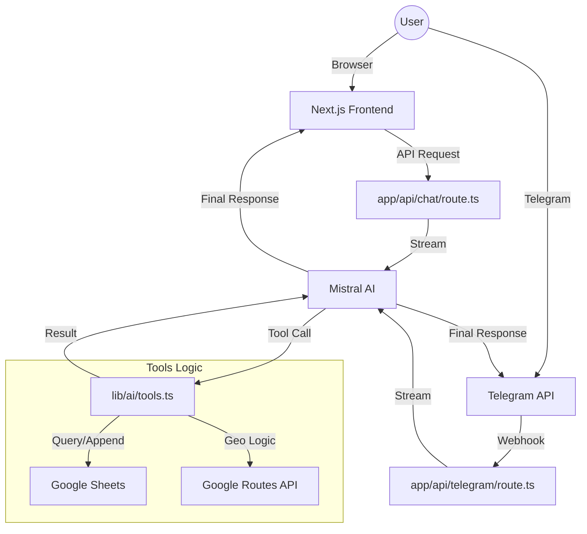

# 📍 Places To Go - Specification Document

## 1. Overview
**Places To Go** is an AI-powered personal tracker designed to manage and discover food destinations. It leverages a conversational interface across both **Web** and **Telegram**, providing a seamless experience for adding new locations and receiving curated recommendations based on their personal Google Sheets data.

## 2. Core Features
- **AI Chat Assistant**: A "roast master" persona powered by Mistral AI. It speaks English, Indonesian, and Javanese with a strictly "one language per message" rule and zero emojis.
- **24/7 Telegram Bot**: Access your tracker anytime via a Telegram bot, secured with user ID filtering.
- **Smart Data Entry (`add_place`)**: 
    - Automatically resolves Google Maps short links.
    - Extracts coordinates and place names from URLs; falls back to Places API and geocoding.
    - Deduplicates by raw link and by Place ID before inserting.
    - Calculates distance (km) and travel time (minutes) from home base and from current location.
    - Saves data directly to a Google Sheet.
- **Smart Lenses**:
    - **`get_nearby_places`**: Find spots closest to the user's current or reference location.
    - **`get_quickest_places`**: Find spots with the shortest travel time.
    - **`get_random_places`**: "Surprise me" discovery, optionally filtered by visit status.
    - **`get_places_by_city`**: Filter places by a specific city name.
    - **`search_places_by_name`**: Fuzzy search across the personal tracker by place name.
- **Global Discovery (`search_google_maps`)**: 
    - Search for new places directly on Google Maps (outside the personal tracker).
    - Returns top 3 results with name, city, and direct Maps link.
- **Visit Tracking (`visit_place`)**:
    - Mark places as visited with a specific date.
    - **Unvisit Capability**: Clear or delete a visit date if marked by mistake.
    - Uses fuzzy matching to find the correct place by name.
- **Delete Capability (`delete_place`)**:
    - Completely remove a place's entire row from the Google Sheet.
    - Automatically shifts up all rows below the deleted place.
    - Invalidates the shared Redis row cache to ensure real-time consistency.
    - Uses fuzzy matching to find the correct place by name.
    - If the deleted place had a priority rank, the remaining priority list is automatically renumbered to close the gap.
- **Priority Queue (`get_priority_places`, `prioritize_place`)**:
    - Tracks which unvisited places to go to next, using the `Priority` column (Column I) — smaller number means higher priority.
    - `get_priority_places` returns only places that have a priority set, sorted ascending by rank, so the agent never has to read the full tracker to answer "what's next?".
    - `prioritize_place` sets or updates a place's rank by name (fuzzy matched):
        - Omitting a priority, or giving one beyond the current lowest rank, sends the place to the back of the queue (current max + 1).
        - Giving a priority within the existing range inserts the place there and shifts every place at or below that rank down by one, keeping ranks contiguous (1..N).
        - Re-prioritizing a place that's already ranked pulls it out of its current slot and reinserts it at the new position — this only rewrites Priority cell values, it never touches or reorders rows.
        - Refuses (with a roast) if the place doesn't exist, or if it's already marked visited — visited places can't be prioritized.
    - Marking a prioritized place as visited (`visit_place`) automatically clears its rank and renumbers the rest of the queue.
- **Location Tools**:
    - **`get_current_location`**: Reverse-geocodes user GPS coordinates to a human-readable address and persists to session.
    - **`sync_all_distances`**: Force-recalculates distances and travel times for all places from the user's GPS or a custom Maps link. Respects the 2km rule when syncing from GPS.
    - **`parse_place_link`**: Resolves a Google Maps short link or coordinate string to extract place name and coordinates.
- **UI & UX Excellence**:
    - "Midnight & Neon" aesthetic with glassmorphism in the web app.
    - Real-time tool execution status indicators.
    - **Sonner Toast Notifications**: Sleek notifications for status updates.
- **Live Location Sync**:
    - Supports real-time GPS tracking from Web and Telegram.
    - **The 2km Rule**: Only recalculates distances if the user moves >2km, saving API costs.
    - **Persistent Sessions**: Stores user location in a dedicated `Session` tab on Google Sheets.
- **Wheel of Places**:
    - Interactive spinning wheel on the web app for randomly deciding where to eat.
    - Fetches the full place list via `/api/places` and lets users cherry-pick which places enter the wheel.
    - Supports filtering by visit status (unvisited / visited / all) and fuzzy search by name or city.
    - Already-picked places are automatically struck through and excluded from subsequent spins within the same session; a reset button restores them.
    - Synthesis-based tick sound on each slice transition (toggleable).
    - Displays a winner modal with place name, city, distance, travel time, and a direct Google Maps link.
- **AI-Driven Error Recovery**: 
    - Secondary AI call in the Telegram bot to interpret and explain technical errors in persona.
- **Demo Mode**:
    - Designed for public or portfolio deployments, separate from the personal instance, without exposing the owner's Google Sheet.
    - Activated via `DEMO_MODE=true` environment variable.
    - Replaces all Google Sheets operations with a Vercel Blob-backed in-memory store (`lib/demo-store.ts`), requiring no Google credentials.
    - Enforces a 75-place cap: oldest entry is automatically dropped when the limit is reached to keep the shared store clean.
    - Telegram bot is fully disabled in demo mode (returns 403).
- **Shared Row Cache**:
    - `getRows()` caches parsed sheet rows in Upstash Redis (`ptg:sheets:rows:*`, 5-minute TTL) instead of per-instance memory, so cache hits are consistent across all serverless invocations rather than tied to whichever warm Vercel instance handled the request.
    - Every write path (`appendRow`, `updateLiveDistances`, `updateSheetLinks`, `updateVisitDate`, `updatePriorities`, `deleteRow`) invalidates the cached key immediately after writing.
    - Shares the same Upstash client as rate limiting (`lib/redis.ts`); gracefully degrades to always-fetch-from-Sheets if Upstash env vars are absent (e.g. local dev).
    - Only used in prod (Google Sheets) mode — demo mode reads/writes Vercel Blob directly and never touches this cache.
- **Per-Tool Rate Limiting**:
    - Protects Google Maps API calls from runaway AI loops, Telegram webhook replays, or accidental abuse.
    - Backed by Upstash Redis (`@upstash/ratelimit`) using a sliding window algorithm, keyed by caller IP.
    - Limits are scoped separately for demo and prod using Redis key namespacing (`ptg:demo:rl:*` vs `ptg:prod:rl:*`), allowing both deployments to share a single Upstash database.
    - Gracefully degrades to no-op if Upstash env vars are absent (e.g. local dev).
    - Cache hits (`lib/ai/tools/dedupe.ts`) bypass the limiter entirely so cached results don't consume quota.
    - Daily limits per tool:
        - `add_place`: 50/day
        - `sync_all_distances`: 10/day
        - `parse_place_link`: 50/day
        - `search_google_maps`: 100/day
        - `get_current_location`: 100/day
        - All other tools (Sheets-only): 500/day

## 3. Tech Stack
### Frontend & Bot
- **Web Framework**: [Next.js 15](https://nextjs.org/) (App Router)
- **Bot Framework**: [grammY](https://grammy.dev/)
- **Styling**: [Tailwind CSS 4](https://tailwindcss.com/)
- **UI Components**: [Shadcn UI](https://ui.shadcn.com/) & [Sonner](https://sonner.emilkowal.ski/)
- **State Management**: Vercel AI SDK (`useChat`)

### Backend & AI
- **Runtime**: Next.js API Routes (Serverless/Edge)
- **AI SDK**: [Vercel AI SDK v6](https://sdk.vercel.ai/docs)
- **LLM Provider**: [Mistral AI](https://mistral.ai/) (`mistral-large-latest`)
- **Language Support**: English, Indonesian, Javanese

### Integration & Infrastructure
- **Database**: [Google Sheets API](https://developers.google.com/sheets/api)
- **Maps Services**: 
    - Google Maps Geocoding API
    - Google Maps Places API (Text Search)
    - Google Routes API (Distance Matrix v2)
- **Rate Limiting**: [Upstash Redis](https://upstash.com/) (`@upstash/ratelimit`)
- **Deployment**: Vercel

## 4. Architecture & Data Flow

## 5. Directory Structure
- `app/`:
    - `api/`:
        - `chat/route.ts`: Web chat API endpoint.
        - `telegram/route.ts`: Telegram webhook endpoint.
    - `page.tsx`: Web chat interface.
- `lib/`:
    - `ai/`:
        - `config.ts`: AI model and system prompt settings.
        - `tools.ts`: Vercel AI SDK tool definitions.
        - `tools/rate-limit.ts`: Per-tool Upstash rate limiting wrapper.
        - `tools/dedupe.ts`: Request-scoped tool execution cache.
    - `bot.ts`: Grammy bot instance and message handling logic.
    - `googleSheets.ts`: Google Sheets API wrapper (rows cached in Redis).
    - `redis.ts`: Shared Upstash Redis client used by rate limiting and the row cache.
- `scripts/`:
    - `set-webhook.ts`: Helper script to configure Telegram webhook.

## 6. Configuration (Environment Variables)
- `MISTRAL_API_KEY`: Authentication for Mistral AI.
- `SPREADSHEET_ID`: Google Sheet ID.
- `GMAPS_API_KEY`: Google Cloud API Key (Must have Geocoding and Routes API enabled).
- `GOOGLE_APPLICATION_CREDENTIALS`: Path/Content of service account JSON.
- `TELEGRAM_BOT_TOKEN`: Token from BotFather.
- `TELEGRAM_ALLOWED_USER_ID`: Comma-separated list of IDs allowed to use the bot.
- `REFERENCE_LAT`: Latitude of your home/base (e.g., -7.7828).
- `REFERENCE_LNG`: Longitude of your home/base (e.g., 110.3608).
- `DEMO_MODE`: Set to `true` to use Vercel Blob storage instead of Google Sheets. Telegram bot is disabled in this mode.
- `BLOB_READ_WRITE_TOKEN`: Vercel Blob token. Required when `DEMO_MODE=true`.
- `UPSTASH_REDIS_REST_URL`: Upstash Redis REST URL. Required for per-tool rate limiting.
- `UPSTASH_REDIS_REST_TOKEN`: Upstash Redis REST token. Required for per-tool rate limiting.

## 7. Future Roadmap
- [x] **Telegram Integration**: 24/7 access via chatbot.
- [ ] **Multi-Tab Support**: Support for different categories beyond "Food".
- [ ] **Interactive Maps**: Embed a map view to visualize all saved locations.
- [ ] **Export Options**: Export the current list to CSV/Excel.
- [ ] **User Authentication**: Support for personal Google Sheets per user.

## 8. UI Theme & Design Guidelines
To maintain visual excellence and premium pair-programming output, all agents MUST follow these theme and styling guidelines strictly:
- **Theme-Aware Glassmorphism**:
    - NEVER hardcode dark or muddy gray colors (e.g., `bg-zinc-950/20`, `border-zinc-800/40`) directly on dynamic glass panels.
    - Always use the `.glass` utility class defined in `app/globals.css`, which dynamically maps `--glass-bg`, `--glass-border`, and `--glass-shadow` using system CSS variables.
- **Contrast & Hierarchy**:
    - **Light Theme**: Avoid using neon colors (`-400` like `text-blue-400`, `text-violet-400`, `text-cyan-400`) directly on white backgrounds. Map active typography/icons dynamically using theme states (e.g., `text-blue-600 dark:text-blue-400` and `bg-blue-50 dark:bg-blue-500/10`).
    - **Solid Panels & Cards**: In light mode, sub-panels (like metrics) should use semi-transparent white backgrounds (`bg-white/70`) with soft borders (`border-black/[0.04]`), and secondary buttons should use crisp outlined borders (`border-black/[0.08] hover:bg-black/[0.02]`) rather than solid gray blocks.
- **Overlay & Dialog Modals**:
    - Always ensure overlays/backdrops behind glass elements are theme-aware (e.g., `bg-black/20 dark:bg-black/60` inside `DialogOverlay`) so that frosted glass cards in light mode remain bright and readable rather than looking muddy due to heavy black backgrounds bleeding through.

