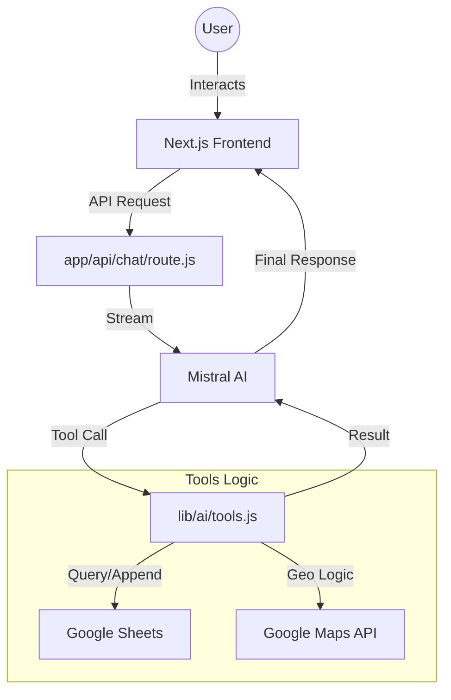

# 📍 Places To Go - Specification Document

## 1. Overview
**Places To Go** is an AI-powered personal tracker designed to manage and discover food destinations. It leverages a conversational interface to allow users to interact with their personal list of places, providing a seamless experience for adding new locations and receiving curated recommendations based on their existing data.

## 2. Core Features
- **AI Chat Assistant**: A natural language interface powered by Mistral AI for managing place data.
- **Smart Data Entry (`add_place`)**: 
    - Automatically resolves Google Maps short links.
    - Extracts coordinates and place names from URLs.
    - Calculates distance (km) and travel time (minutes) from a fixed reference point using Google Maps Distance Matrix API.
    - Saves data directly to a Google Sheet.
- **Context-Aware Recommendations (`recommend_place`)**: Fetches existing entries from the tracker to provide suggestions.
- **Premium UI/UX**: 
    - "Midnight & Neon" aesthetic with glassmorphism.
    - Real-time tool execution status indicators.
    - Mobile-optimized responsive design.

## 3. Tech Stack
### Frontend
- **Framework**: [Next.js 15](https://nextjs.org/) (App Router)
- **Library**: [React 19](https://react.dev/)
- **Styling**: [Tailwind CSS 4](https://tailwindcss.com/)
- **Icons**: [Lucide React](https://lucide.dev/)
- **State Management**: Vercel AI SDK (`useChat`)

### Backend & AI
- **Runtime**: Next.js API Routes (Edge/Serverless)
- **AI SDK**: [Vercel AI SDK v6](https://sdk.vercel.ai/docs)
- **LLM Provider**: [Mistral AI](https://mistral.ai/) (`mistral-large-latest`)
- **Validation**: [Zod](https://zod.dev/)

### Integration & Infrastructure
- **Database**: [Google Sheets API](https://developers.google.com/sheets/api) (as a flexible, collaborative DB)
- **Maps Services**: 
    - Google Maps Geocoding API
    - Google Routes API (Distance Matrix v2)
- **Authentication**: `google-auth-library`

## 4. Architecture & Data Flow

## 5. Directory Structure
- `app/`: Contains the main application pages and API routes.
    - `page.js`: The chat interface and UI logic.
    - `api/chat/route.js`: The AI orchestrator.
- `lib/`: Core business logic and integrations.
    - `ai/tools.js`: Vercel AI SDK tool definitions (`add_place`, `recommend_place`).
    - `googleSheets.js`: Google Sheets API wrapper for reading and writing rows.
- `scripts/`: Implementation scripts and legacy build helpers.
- `skills/`: Modular logic for specific features (e.g., `add_place`).

## 6. Configuration (Environment Variables)
To run this application, the following environment variables are required:
- `MISTRAL_API_KEY`: Authentication for Mistral AI.
- `SPREADSHEET_ID`: The ID of the Google Sheet acting as the database.
- `GMAPS_API_KEY`: API key with access to Geocoding and Routes APIs.
- `GOOGLE_APPLICATION_CREDENTIALS`: Path to the service account JSON for Google Sheets access.

## 7. Future Roadmap
- [ ] **Multi-Tab Support**: Support for different categories beyond "Food" (e.g., "Sightseeing", "Cafes").
- [ ] **Interactive Maps**: Embed a map view to visualize all saved locations.
- [ ] **Export Options**: Export the current list to CSV/Excel using the integrated `xlsx` library.
- [ ] **User Authentication**: Support for personal Google Sheets per user.
