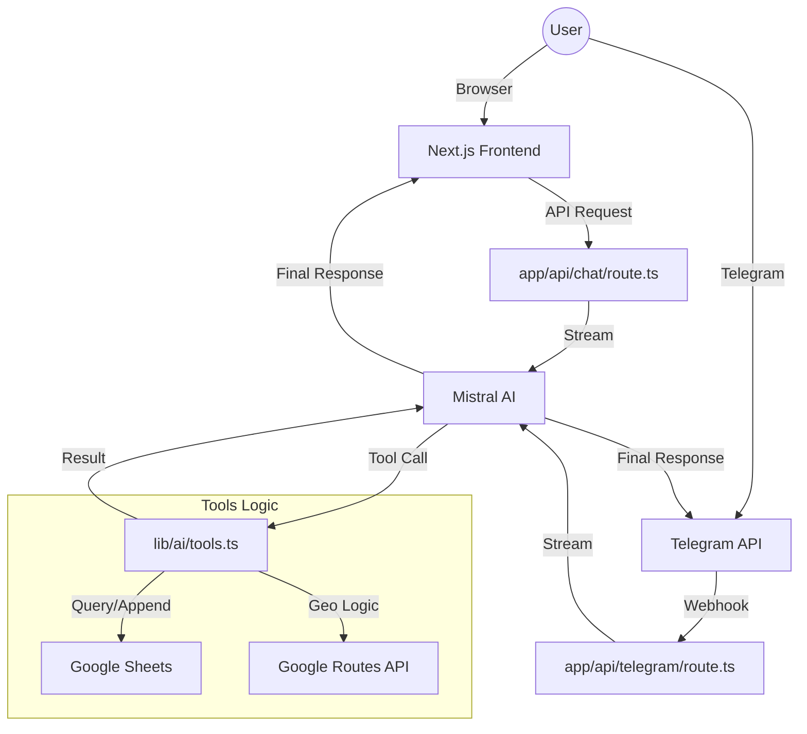

# 📍 Places To Go - Specification Document

## 1. Overview
**Places To Go** is an AI-powered personal tracker designed to manage and discover food destinations. It leverages a conversational interface across both **Web** and **Telegram**, providing a seamless experience for adding new locations and receiving curated recommendations based on their personal Google Sheets data.

## 2. Core Features
- **AI Chat Assistant**: A natural language interface powered by Mistral AI, speaking English, Indonesian, and Javanese.
- **24/7 Telegram Bot**: Access your tracker anytime via a Telegram bot, secured with user ID filtering.
- **Smart Data Entry (`add_place`)**: 
    - Automatically resolves Google Maps short links.
    - Extracts coordinates and place names from URLs.
    - Calculates distance (km) and travel time (minutes) using Google Maps Routes API.
    - Saves data directly to a Google Sheet.
- **Smart Lenses (`recommend_place`)**: 
    - **Nearby**: Find spots closest to your reference point.
    - **Quickest**: Find spots with the shortest travel time.
    - **Random**: "Surprise me" discovery.
    - **City-based**: Filter by specific cities.
    - "Midnight & Neon" aesthetic with glassmorphism in the web app.
    - Real-time tool execution status indicators.
    - **Sonner Toast Notifications**: Sleek notifications for status updates.
- **Live Location Sync**:
    - Supports real-time GPS tracking from Web and Telegram.
    - **The 2km Rule**: Only recalculates distances if the user moves >2km, saving API costs.
    - **Persistent Sessions**: Stores user location in a dedicated `Session` tab on Google Sheets.

## 3. Tech Stack
### Frontend & Bot
- **Web Framework**: [Next.js 15](https://nextjs.org/) (App Router)
- **Bot Framework**: [grammY](https://grammy.dev/)
- **Styling**: [Tailwind CSS 4](https://tailwindcss.com/)
- **UI Components**: [Shadcn UI](https://ui.shadcn.com/) & [Sonner](https://sonner.emilkowal.ski/)
- **State Management**: Vercel AI SDK (`useChat`)

### Backend & AI
- **Runtime**: Next.js API Routes (Serverless/Edge)
- **AI SDK**: [Vercel AI SDK v6](https://sdk.vercel.ai/docs)
- **LLM Provider**: [Mistral AI](https://mistral.ai/) (`mistral-large-latest`)
- **Language Support**: English, Indonesian, Javanese

### Integration & Infrastructure
- **Database**: [Google Sheets API](https://developers.google.com/sheets/api)
- **Maps Services**: 
    - Google Maps Geocoding API
    - Google Routes API (Distance Matrix v2)
- **Deployment**: Vercel

## 4. Architecture & Data Flow

## 5. Directory Structure
- `app/`:
    - `api/`:
        - `chat/route.ts`: Web chat API endpoint.
        - `telegram/route.ts`: Telegram webhook endpoint.
    - `page.tsx`: Web chat interface.
- `lib/`:
    - `ai/`:
        - `config.ts`: AI model and system prompt settings.
        - `tools.ts`: Vercel AI SDK tool definitions.
    - `bot.ts`: Grammy bot instance and message handling logic.
    - `googleSheets.ts`: Google Sheets API wrapper.
- `scripts/`:
    - `set-webhook.ts`: Helper script to configure Telegram webhook.

## 6. Configuration (Environment Variables)
- `MISTRAL_API_KEY`: Authentication for Mistral AI.
- `SPREADSHEET_ID`: Google Sheet ID.
- `GMAPS_API_KEY`: Google Cloud API Key.
- `GOOGLE_APPLICATION_CREDENTIALS`: Path/Content of service account JSON.
- `TELEGRAM_BOT_TOKEN`: Token from BotFather.
- `TELEGRAM_ALLOWED_USER_ID`: Comma-separated list of IDs allowed to use the bot.

## 7. Future Roadmap
- [x] **Telegram Integration**: 24/7 access via chatbot.
- [ ] **Multi-Tab Support**: Support for different categories beyond "Food".
- [ ] **Interactive Maps**: Embed a map view to visualize all saved locations.
- [ ] **Export Options**: Export the current list to CSV/Excel.
- [ ] **User Authentication**: Support for personal Google Sheets per user.
